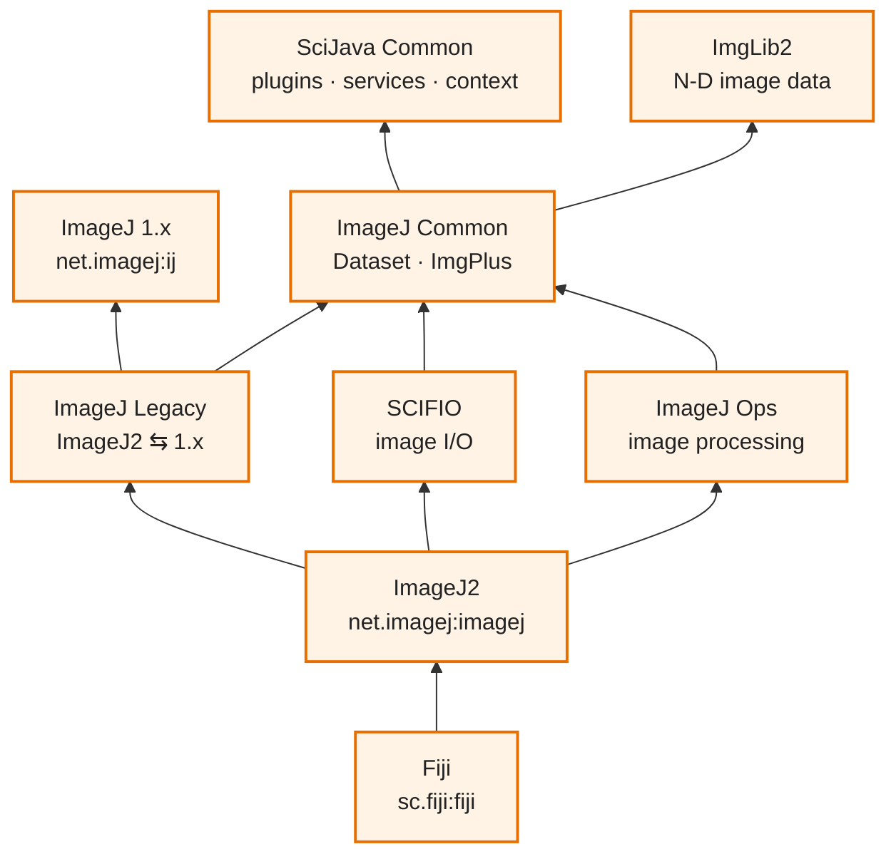
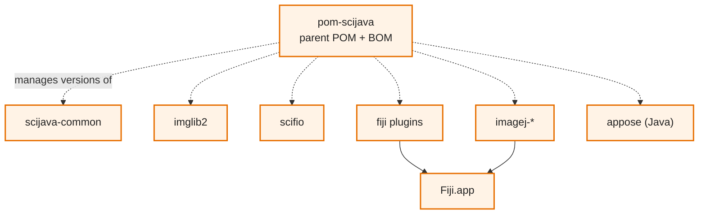
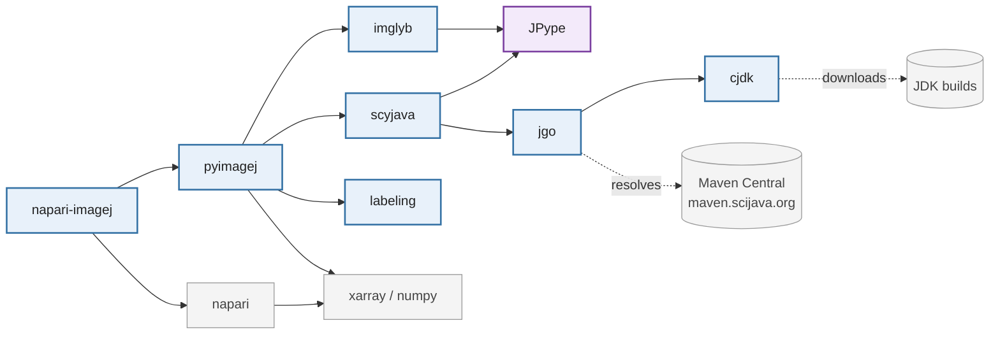
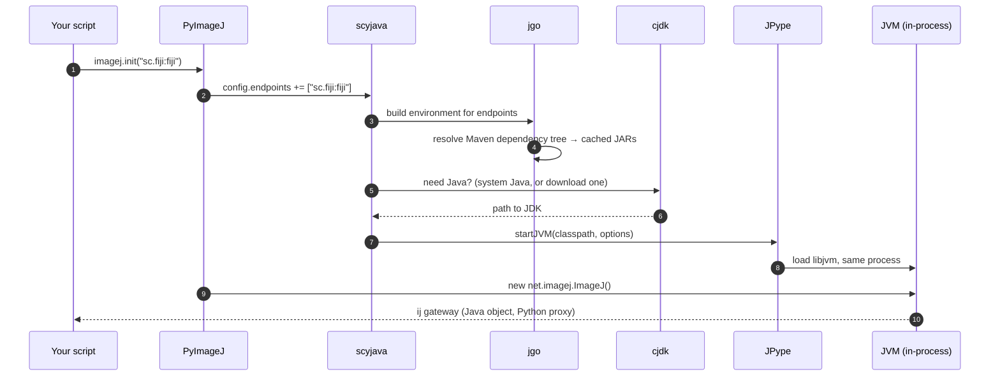
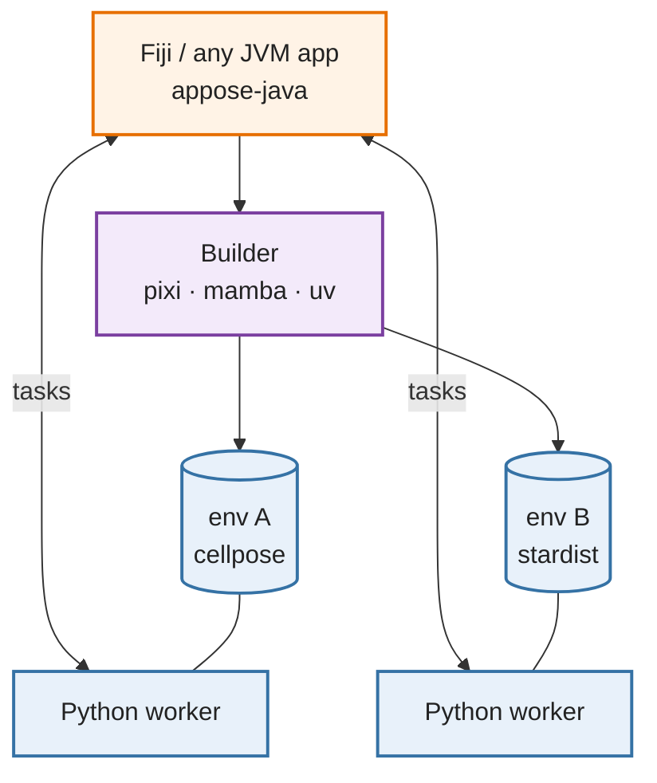
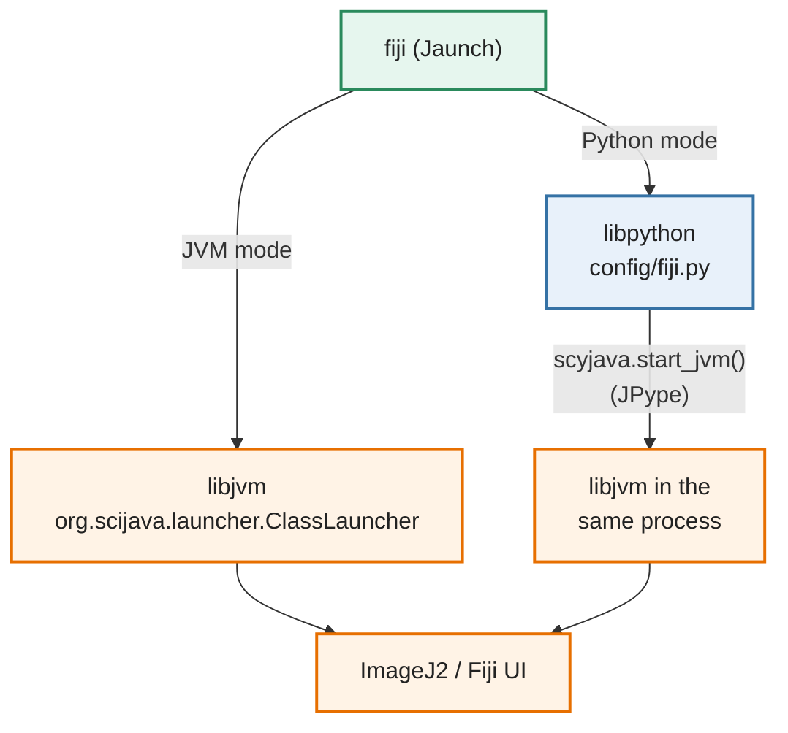
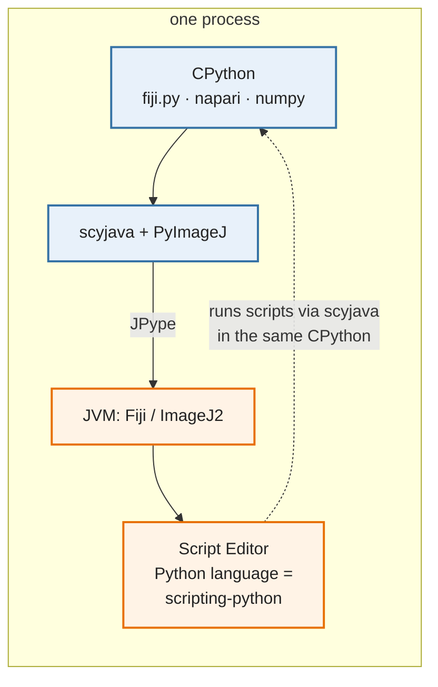

# The Fiji Software Stack

How the <span class="java">Java</span> and <span class="py">Python</span> projects fit together

<div class="mt-10 muted text-sm">
SciJava · ImgLib2 · SCIFIO · ImageJ · ImageJ2 · Fiji · Jaunch<br>
cjdk · jgo · JPype · scyjava · imglyb · PyImageJ · napari-imagej · Appose
</div>

---

# The big picture

<div class="world">
  <div class="col">
    <h3 class="java">Java world</h3>
    <div class="box j"><b>Fiji</b><small>distribution: ImageJ2 + curated plugins</small></div>
    <div class="box j"><b>ImageJ2</b><small>imagej-common · imagej-ops · imagej-legacy · updater</small></div>
    <div class="box j"><b>ImageJ (1.x)</b><small>the original ImageJ (<code>net.imagej:ij</code>)</small></div>
    <div class="box j"><b>SCIFIO</b> · <b>ImgLib2</b><small>image I/O · N-dimensional image data</small></div>
    <div class="box j"><b>SciJava</b><small>scijava-common · pom-scijava (the BOM)</small></div>
  </div>
  <div class="mid">
    <h3>&nbsp;</h3>
    <div class="box b">
        <b>JPype</b><small>same process</small>
        <div class="arrow">⇆ JNI ⇆</div>
    </div>
    <div class="box b">
        <b>Appose</b><small>separate processes</small>
        <div class="arrow">⇆ pipes + shared memory ⇆</div>
    </div>
    <div class="box l"><b>Jaunch</b><small>native launcher: JVM or Python</small></div>
  </div>
  <div class="col">
    <h3 class="py">Python world</h3>
    <div class="box p"><b>napari-imagej</b><small>Fiji inside napari</small></div>
    <div class="box p"><b>PyImageJ</b><small><code>imagej.init()</code>: ImageJ2 from Python</small></div>
    <div class="box p"><b>imglyb</b><small>NumPy ⇆ ImgLib2, no copying</small></div>
    <div class="box p"><b>scyjava</b><small><code>jimport</code>, type conversion, JVM config</small></div>
    <div class="box p"><b>jgo</b> · <b>cjdk</b><small>Maven dependencies → classpath · fetch a JDK</small></div>
  </div>
</div>

<div class="legend">
  <span class="lj">Java library</span><span class="lp">Python package</span>
  <span class="lb">cross-language bridge</span><span class="ll">launcher</span>
</div>

<!--
The mental model: two stacks of the same general shape, side by side, with bridges between them.
Each side has a bottom layer that deals with "how do I get code and run it" and a top layer that is the actual user-facing app.
-->

---

# What do the names mean?

| Name | What it is | Language | Where |
|---|---|---|---|
| **SciJava** | Foundation libraries: plugin framework, app context, scripting, Maven parent POM | <span class="java">Java</span> | `github.com/scijava` · `org.scijava` |
| **ImgLib2** | The N-dimensional image data model | <span class="java">Java</span> | `github.com/imglib` · `net.imglib2` |
| **SCIFIO** | Image I/O and file formats (wraps Bio-Formats) | <span class="java">Java</span> | `github.com/scifio` · `io.scif` |
| **ImageJ** (1.x) | The original ImageJ by Wayne Rasband | <span class="java">Java</span> | `github.com/imagej/ImageJ` · `net.imagej:ij` |
| **ImageJ2** | Rewrite on SciJava + ImgLib2; runs ImageJ 1.x inside via *imagej-legacy* | <span class="java">Java</span> | `github.com/imagej` · `net.imagej` |
| **Fiji** | "Fiji Is Just ImageJ": ImageJ2 plus a curated set of plugins | <span class="java">Java</span> | `github.com/fiji` · `sc.fiji` |
| **scyjava** | Java access from Python; built on JPype and jgo | <span class="py">Python</span> | `github.com/scijava/scyjava` |
| **PyImageJ** | ImageJ2/Fiji from Python | <span class="py">Python</span> | `github.com/imagej/pyimagej` |
| **jgo**, **Appose**, **Jaunch** | Tools for launching and connecting runtimes | <span class="py">Py</span> / <span class="java">Java</span> / native | `github.com/apposed` |

<div class="callout">
"ImageJ" alone is ambiguous: it can mean the original ImageJ, ImageJ2, or the whole ecosystem. Say which one you mean.
</div>

---
layout: two-cols-header
---

# The Java side: foundational layers

::left::

Each layer is its own **GitHub org** and **Maven groupId**, with its own team.



::right::

<div class="pl-6 text-sm">

**Arrows mean "depends on".**

- **SciJava Common** finds plugins with a compile-time annotation index, so every layer above can add new plugins.
- **ImgLib2** is a library with no UI. It is also used outside ImageJ (BigDataViewer, Mastodon, …).
- **ImageJ Legacy** patches ImageJ 1.x at runtime (via *ij1-patcher*), so old macros and plugins run inside ImageJ2.
- **Fiji** adds hundreds of plugins (TrackMate, BigDataViewer, Trainable Weka Segmentation, …) on top of ImageJ2.

</div>

---

# Holding the Java side together: **pom-scijava**

<div class="grid grid-cols-2 gap-8">
<div>

Every component extends the **`pom-scijava`** parent POM:

- It is a **Bill of Materials**: one set of component versions known to work together.
- It provides shared build defaults, such as the Java version, plugins, and release rules.
- It bans `SNAPSHOT` dependencies, so builds are **reproducible**.

Artifacts are hosted on **Maven Central** and **maven.scijava.org**.

<div class="callout">
Fiji's <code>pom.xml</code> is itself "just" a list of dependencies managed by pom-scijava. A Fiji installation is that dependency tree, materialized and kept current by the <b>ImageJ Updater</b>.
</div>

</div>
<div>



</div>
</div>

<!--
This Maven structure matters for the Python side too: jgo and scyjava resolve exactly these Maven coordinates to build a classpath.
-->

---

# The Python stack

<div class="stack">
  <div class="layer p"><span class="name">napari-imagej</span><span class="desc">napari plugin: search and run Fiji commands, move layers ⇆ images</span><span class="chips"><span class="chip">imagej/napari-imagej</span></span></div>
  <div class="layer p"><span class="name">PyImageJ</span><span class="desc"><code>ij = imagej.init("sc.fiji:fiji")</code> · <code>ij.py.from_java</code> / <code>to_java</code> · xarray metadata</span><span class="chips"><span class="chip">imagej/pyimagej</span></span></div>
  <div class="layer p"><span class="name">imglyb</span><span class="desc">wraps NumPy arrays as ImgLib2 images in shared memory (Java half: <i>imglib2-imglyb</i>)</span><span class="chips"><span class="chip">imglib/imglyb</span></span></div>
  <div class="layer p"><span class="name">scyjava</span><span class="desc"><code>jimport</code>, <code>config.endpoints</code>, <code>to_java</code>/<code>to_python</code> converters, JVM startup</span><span class="chips"><span class="chip">scijava/scyjava</span></span></div>
  <div class="layer b"><span class="name">JPype</span><span class="desc">starts a JVM <b>inside the Python process</b> via JNI; Java objects become Python proxies</span><span class="chips"><span class="chip">jpype-project/jpype</span></span></div>
  <div class="layer p"><span class="name">jgo</span><span class="desc">Maven coordinates → resolved dependencies → classpath, in pure Python (no Maven install needed)</span><span class="chips"><span class="chip">apposed/jgo</span></span></div>
  <div class="layer p"><span class="name">cjdk</span><span class="desc">downloads and caches a suitable JDK on demand (no Java install needed)</span><span class="chips"><span class="chip">cachedjdk/cjdk</span></span></div>
</div>

<div class="mt-3 text-sm muted">
Each layer is a separate PyPI package, and each is useful on its own. For example, use jgo to run any Java app, or scyjava for any Java library.
</div>

---

# Python dependency graph



<div class="callout">
<b>scyjava</b> is the Python counterpart of <b>scijava-common</b>: a general foundation layer with nothing image-specific, used by PyImageJ and other Java-backed Python packages such as CellProfiler and bffile.
</div>

---

# What happens in `imagej.init("sc.fiji:fiji")`?



<div class="text-sm muted">
To use a local Fiji installation, call <code>imagej.init("/path/to/Fiji.app")</code>. That skips the Maven step and uses the installation's <code>jars/</code> and <code>plugins/</code>.
</div>

---

# Two ways to cross the language boundary

<div class="grid grid-cols-2 gap-6">
<div>

### <span class="bridge">In-process</span>: JPype

<div class="proc">
  <div class="title">one OS process</div>
  <div class="proc-row">
    <div class="box p">CPython</div>
    <div class="wire">⇆ JNI ⇆</div>
    <div class="box j">JVM</div>
  </div>
</div>

- Direct calls between languages; Java objects are live
- Zero-copy arrays (imglyb)
- **One** Python environment and **one** classpath
- Threading and GUI event loops can conflict, especially on macOS

<div class="text-sm">Used by: <b>scyjava</b>, <b>PyImageJ</b>, <b>napari-imagej</b>, <b>Fiji Python mode</b></div>

</div>
<div>

### <span class="bridge">Inter-process</span>: Appose

<div class="proc">
  <div class="title">two OS processes</div>
  <div class="proc-row">
    <div class="box j">JVM<small>Service</small></div>
    <div class="wire">stdin/stdout JSON<br/>+ shared memory</div>
    <div class="box p">Python<small>worker</small></div>
  </div>
</div>

- Each worker gets its **own isolated environment**
- Conflicting dependencies are fine (e.g. PyTorch vs TensorFlow)
- NDArrays passed via **named shared memory** (zero-copy)
- Costs a process spawn; non-array data is serialized as JSON

<div class="text-sm">Used by: <b>scripting-appose-python</b>, deep-learning plugins, <b>imglib2-appose</b></div>

</div>
</div>

---

# Appose

<div class="grid grid-cols-5 gap-6">
<div class="col-span-3">

A small library for **interprocess cooperation with shared memory**.

1. **Build** an `Environment` with standard tools: *pixi*, *micromamba*, *uv*, or Maven
2. Start a **`Service`**: a worker process in that environment
3. Run **`Task`s** (scripts) on it and get async status callbacks
4. Pass **`NDArray`s** through named shared memory

Implementations:
<span class="chip">appose-java</span>
<span class="chip">appose-python</span>
<span class="chip">Appose.jl</span>

Any language works as a worker if it follows the JSON-over-stdio *worker contract*.

</div>
<div class="col-span-2">



</div>
</div>

<div class="callout">
<b>imglib2-appose</b> wraps Appose NDArrays as ImgLib2 images (<code>ShmImg</code>), so Fiji images can go to Python workers without copying.
</div>

---

# Jaunch: the native launcher

<div class="grid grid-cols-2 gap-8">
<div>

`fiji` / `fiji.exe` is a **Jaunch** executable (from `apposed/jaunch`):

- A small native binary plus TOML config (`config/jaunch/*.toml`)
- Finds a suitable **JVM** *or* **Python**, then loads it **in-process** (`libjvm` / `libpython`)
- Same CLI for both modes: `--mem=8g`, `--headless`, `--debug`, …

```bash
./fiji             # JVM mode (default)
./fiji --python    # Python mode
./fiji --dry-run   # show the launch command
```

</div>
<div>



</div>
</div>

---

# Fiji's Python mode

<div class="grid grid-cols-2 gap-6">
<div>

Same Fiji, but **Python is the host process**:

1. Jaunch loads `libpython` from Fiji's Python environment
2. Runs **`config/fiji.py`**, which calls `scyjava.start_jvm()` with Fiji's classpath, then `imagej.init(app_dir)` (**PyImageJ**)
3. On macOS, the Qt event loop runs on the main thread, so **napari** and **ndv** can run next to the Swing UI

The environment comes from `config/environment.yml` (pyimagej, appose, napari-imagej, ndv, scikit-image, …). It is built with **Appose** from *Edit › Options › Python…*

</div>
<div>



</div>
</div>

<div class="callout">
<b>scripting-python</b> is a SciJava script language that only works in Python mode. A <code>.py</code> script runs in the host CPython through <b>scyjava/PyImageJ</b>, sharing its packages and objects. All scripts share one environment.
</div>

---

# Python in Fiji: four options

| | Process model | Python | pip packages | Built on |
|---|---|---|---|---|
| **Jython** | inside the JVM | 2.7 syntax | ✗ (Java libraries only) | scripting-jython |
| **Fiji Python mode** | one process, Python host | CPython 3, **one shared environment** | ✓ | Jaunch + scyjava + PyImageJ (scripting-python) |
| **Appose scripts** | subprocess per environment | CPython 3, **one environment per script** | ✓ (isolated) | Appose (scripting-appose-python) |
| **PyImageJ** (outside Fiji) | one process, your Python | CPython 3, your environment | ✓ | scyjava + JPype + jgo |

<div class="grid grid-cols-2 gap-6 mt-4 text-sm">
<div>

**scripting-appose-python** script:
```python
#!appose-python
# /// script
# dependencies = ["appose", "scipy"]
# ///
#@ Img image
#@ double sigma
#@output Img blurred
from scipy.ndimage import gaussian_filter
blurred = gaussian_filter(image, sigma)
```

</div>
<div>

**PyImageJ** from a notebook:
```python
import imagej
ij = imagej.init("sc.fiji:fiji")
img = ij.io().open("blobs.tif")
arr = ij.py.from_java(img)   # → xarray
result = ij.op().filter().gauss(img, 2.0)
```

</div>
</div>

---

# Who is in charge?

<div class="grid grid-cols-2 gap-8 mt-4">
<div class="proc">
  <div class="title py">Python is the host process</div>
  <div class="proc-row">
    <div class="box p">Jupyter / script</div>
    <div class="box p">napari<br/>+ napari-imagej</div>
    <div class="box p">Fiji Python mode<br/><small>fiji.py</small></div>
  </div>
  <div class="wire">↓</div>
  <div class="proc-row"><div class="box p" style="min-width:60%">PyImageJ → scyjava</div></div>
  <div class="wire">↓ JPype (same process)</div>
  <div class="proc-row"><div class="box j" style="min-width:60%">JVM: ImageJ2 / Fiji</div></div>
</div>
<div class="proc">
  <div class="title java">Java is the host process</div>
  <div class="proc-row"><div class="box j" style="min-width:60%">Fiji (JVM mode)</div></div>
  <div class="wire">↓</div>
  <div class="proc-row">
    <div class="box j">Jython<br/><small>inside the JVM</small></div>
    <div class="box j">scripting-appose-python<br/><small>and plugins using Appose</small></div>
  </div>
  <div class="wire" style="margin-left:40%">↓ Appose (subprocess)</div>
  <div class="proc-row" style="justify-content:flex-end">
    <div class="box p">Python worker(s)<br/><small>one environment each</small></div>
  </div>
</div>
</div>

<div class="callout">
Appose is symmetric: <b>appose-python</b> can also start a <b>Java or Groovy worker</b> from Python. Each tool can be the host or the guest.
</div>

---

# Cheat sheet

<div class="grid grid-cols-2 gap-6 text-sm">
<div>

### <span class="java">Java</span>
- **scijava-common**: plugin framework, services, Context
- **pom-scijava**: parent POM + Bill of Materials
- **ImgLib2**: N-D images, views, algorithms
- **SCIFIO**: image I/O (Bio-Formats bridge)
- **ImageJ** (`ij`): the original app
- **ImageJ2**: modern core, runs the original ImageJ via **imagej-legacy**
- **Fiji**: ImageJ2 + curated plugins + Updater
- **scripting-python**: Python language for Python mode
- **scripting-appose-python**: Python via Appose
- **imglib2-appose**: ImgLib2 ⇆ Appose NDArray

</div>
<div>

### <span class="py">Python</span>
- **cjdk**: fetch a JDK on demand
- **jgo**: Maven → classpath → run (no Maven needed)
- **JPype**: JVM inside CPython
- **scyjava**: friendly Java access (JPype + jgo)
- **imglyb**: NumPy ⇆ ImgLib2 shared memory
- **PyImageJ**: ImageJ2/Fiji gateway for Python
- **napari-imagej**: Fiji commands in napari

### <span class="bridge">Across both</span>
- **Appose**: environments + workers + shared memory
- **Jaunch**: native launcher for JVM and/or Python

</div>
</div>

---
layout: center
class: text-center
---

# Learn more

<div class="text-left inline-block text-sm leading-7">

- Architecture of the Java stack: **imagej.net/develop/architecture**
- Python with Fiji, compared: **imagej.net/scripting/python**
- PyImageJ: **py.imagej.net**
- scyjava: **github.com/scijava/scyjava**
- jgo: **jgo.apposed.org**
- Appose: **apposed.org** · workshop: **fiji.github.io/i2k-2025-appose**
- Jaunch: **github.com/apposed/jaunch**
- Help: **forum.image.sc**

</div>
